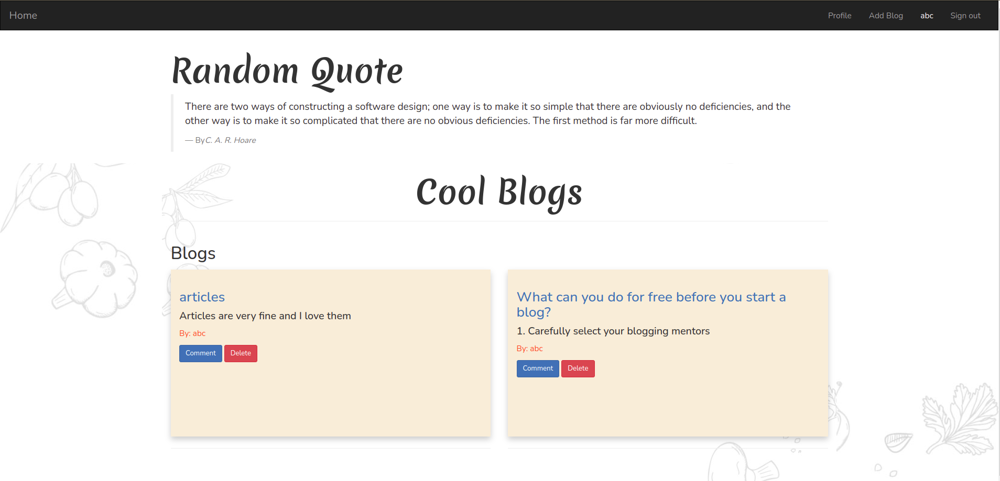

# Bloggy

## Description

   > This app works just like a phonebook

   

## Prerequisites

    + Python3.9
    + flask
    + Virtual environment.

## How to run the app

1. Clone the project by running the following command:  git clone https://github.com/bonface221/personal-blog.git
2. Install the dependencies in the requirements.txt file.
3. Create a database and run migrations.
4. The run python manage.py to run the server.

## Technology used

+ [X] Python3.9
+ [x] flask
+ [x] SQLAlchemy (postgresql)

## Contributing

Please create a pull request here: https://github.com/bonface221/personal-blog/compare

### Link to view the app (heroku)
 deploying in a few 

## Author

[Bonface221](https://github.com/bonface221)

##License ([MIT License](./LICENSE))

This project is licensed under the MIT Open Source license, (c) bonface221

Follow the link to view the licence.